# GeeksHubs  

<a>Proyecto 5- FRONTEND TattooStudio Inks Sydney.</a>

## Tabla de contenidos

- [Descripción 📝](#Descripción)
- [Tecnologías - Bibliotecas - Herramientas 🛠️](#Tecnologías-y-Bibliotecas-Herramientas)
- [Instalación  🚀](#Instalación)
- [Vistas-Componentes ⛏️⚙️](#Vistas-Componentes)
- [Contribuciones  🤝](#Contribuciones)
- [Licencia y Copyright📃](#licencia-y-copyright)

## Descripción

Este Frontend completa el Backend realizado para el estudio de tatuajes **INKS SYDNEY**. Permite a los usuarios (clientes, artistas de tatuajes y administradores) programar, modificar, mostrar y eliminar citas. Además, proporciona funciones de autenticación y autorización para garantizar la seguridad de los datos, así como una vista detallada del estudio, sus tatuadores y trabajos realizados.

## Tecnologías-Bibliotecas-Herramientas

-  **Node.js** 
-  **Vite**    
-  **React**   
-  **Axios**   
- **JWT para autenticación** 
- **Bcrypt para el hashing de contraseñas** 
- **Font Awesome** 
- **Visual Studio Code** 
- **Github** 
- **Git** 

## Instalación

1. Clona el repositorio: `git clone <url>`
2. Instala las dependencias: `npm install`

## Vistas - Componentes

 ### Home - Studio (StudioGallery)

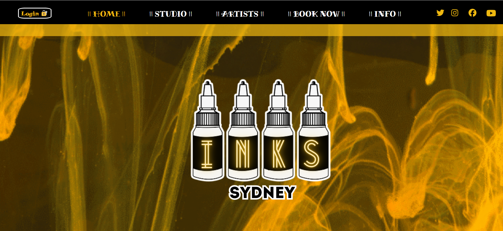 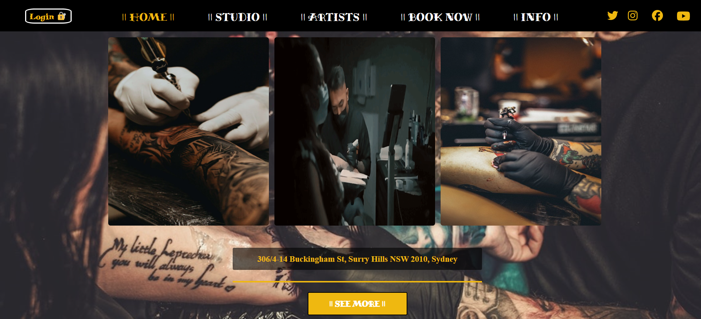

**Home** es la vista principal, desde donde se puede acceder a las diferentes partes de la página. El Header, el cual está programado para que no aparezca en todas las vistas, es interactivo, desplazando al usuario por la página, permitiendo acceder, registrar o cerrar sesión. Antes de acceder, aparece en la parte izquierda "Login", pero una vez que ya se encuentra el usuario logueado, aparece su nombre y un select con **Profile** y **Log Out** -también **Users** para el admin- que se explican posteriormente.

**Studio** es una pequeña introducción a las instalaciones de Inks Sydney. La imagen central tiene movimiento. Pulsando "See More" aparece una nueva vista.

**StudioGallery** 

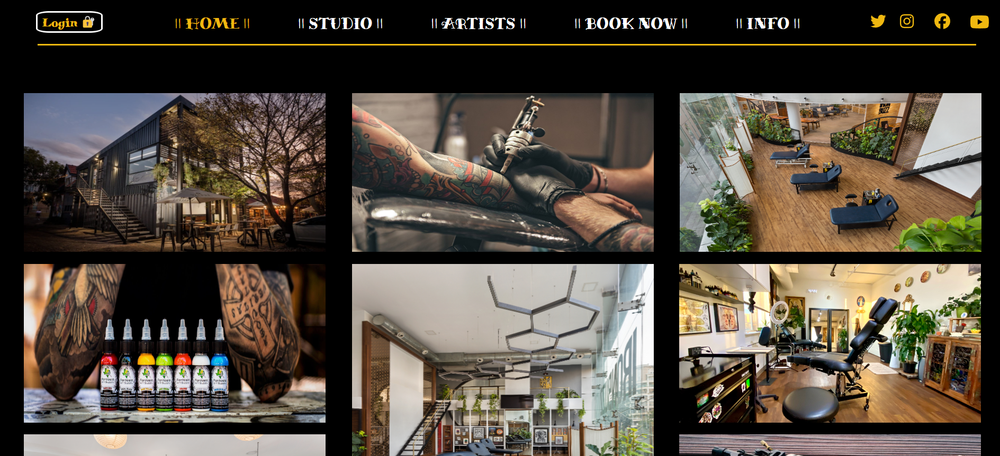 

## Artists - Footer 

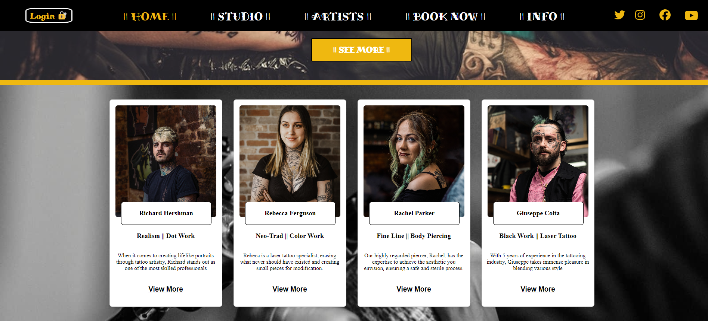 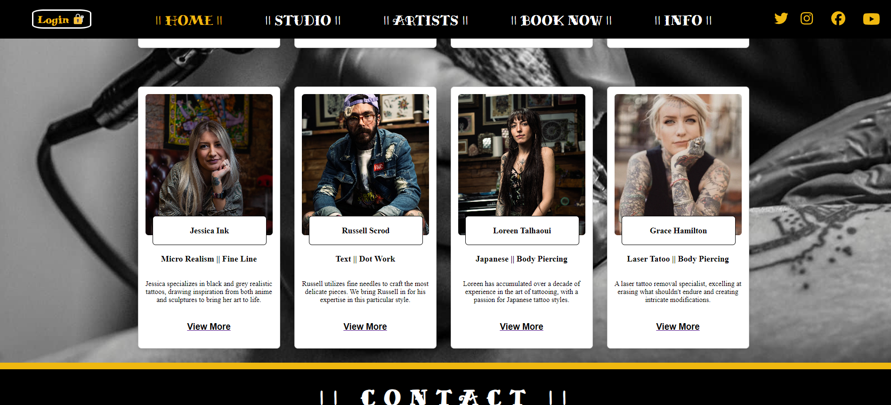

**Artists** Pulsando en "View More" te desplazas a la galería de tatuajes, formada por un carousel propio que se desplaza cada 1.5s o mediante teclado. Pulsado sobre la imagen se paraliza el movimiento del carousel.

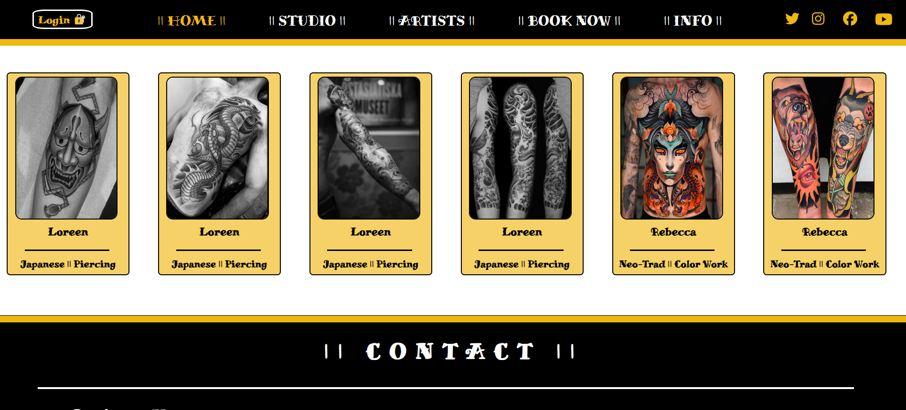 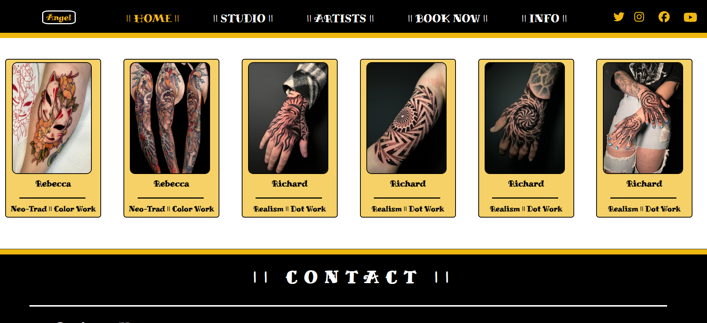

## Login - Register

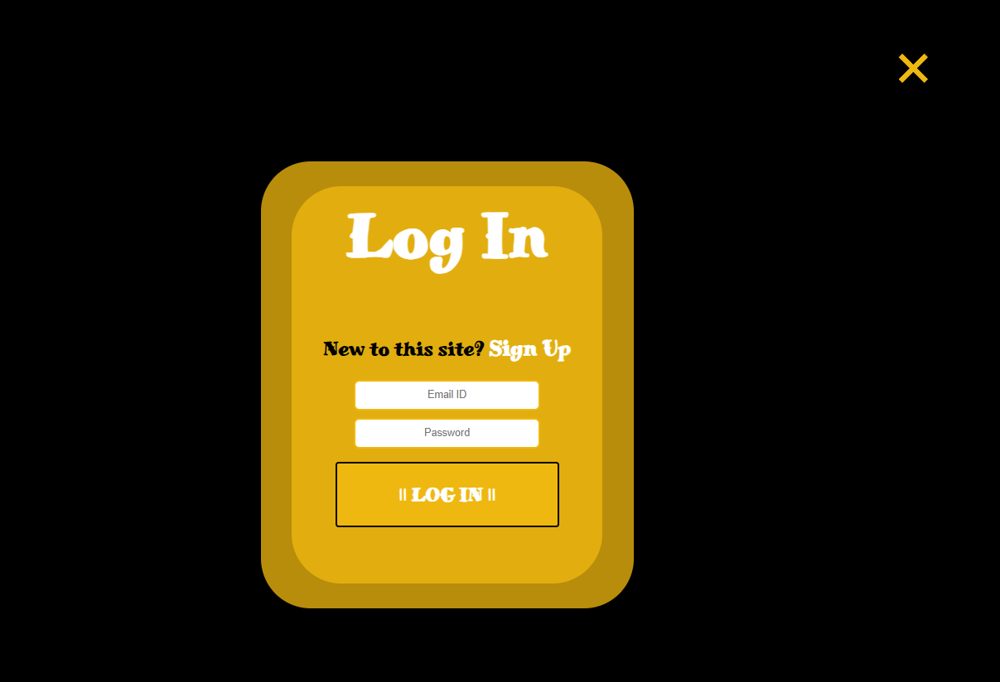 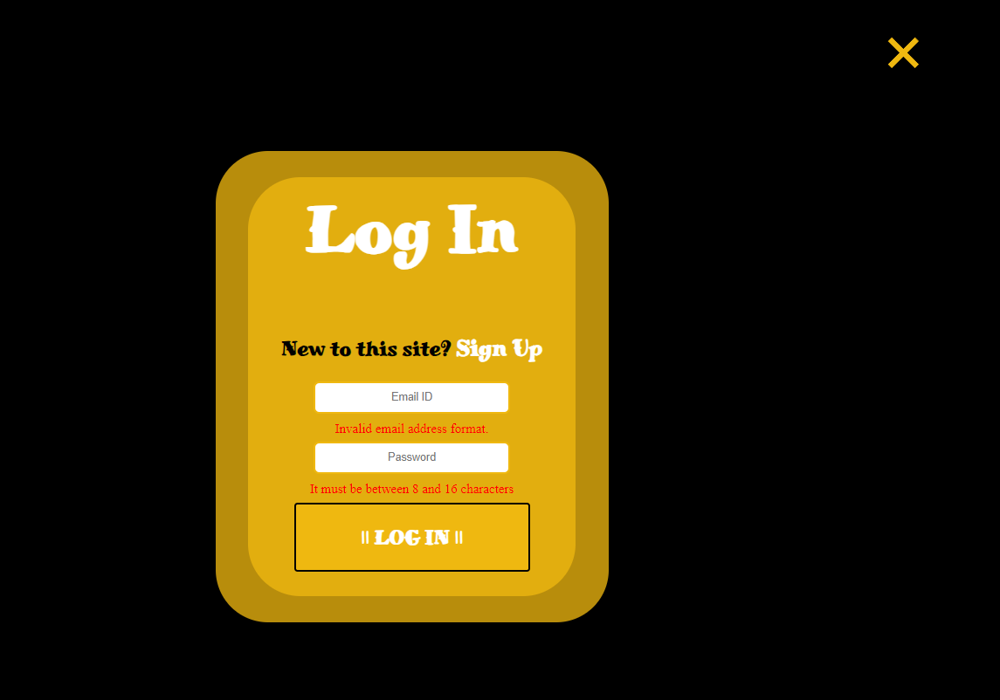

En caso de no introducir un email y una contraseña que cumplan con los requisitos, aparecen mensajes de alerta. Esto también sucede en el caso del registro.

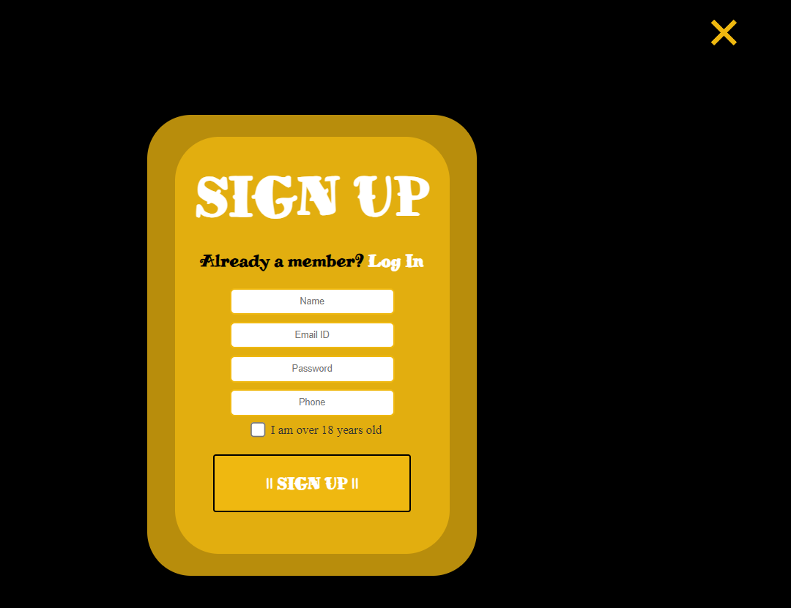 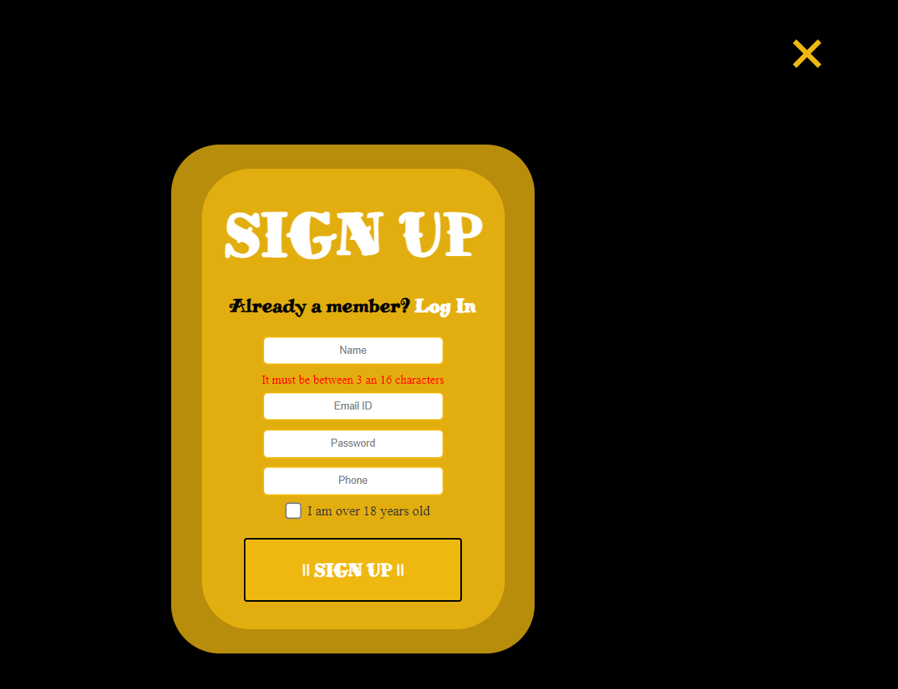

Una vez registrado, se debe hacer login para poder acceder. Aparecerá un mensaje de bienvenida posteriormente.

## Profile - Admin

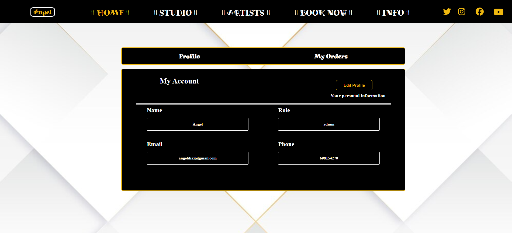 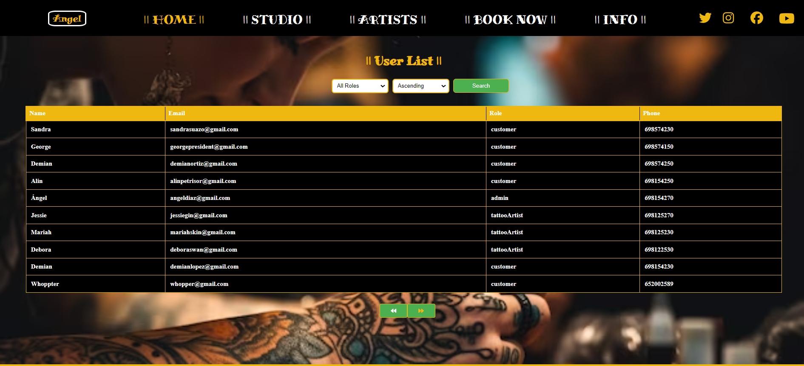

En **profile** aparecen los datos recibidos del token una vez que el usuario hace login. En cuanto al listado de los usuarios registrados, solo el admin tiene acceso. Se ha incorporado paginación de 10 elementos por página. También se puede realizar búsqueda por role -customer, tattooArtist o admin- así como de forma ascendente o descendente.

## Book Now

Solo se puede acceder si existe **token**, es decir, si se ha logueado el usuario. Si se intenta entrar sin ese requisito, aparece un mensaje solicitando el login al usuario. 

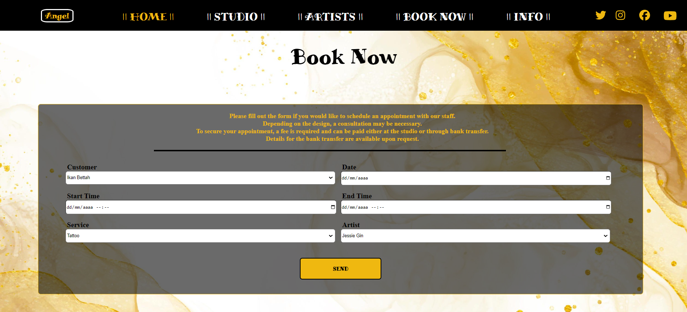 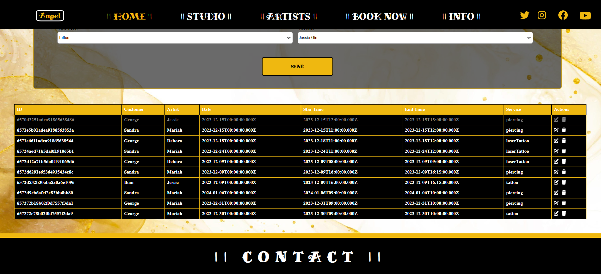

El borrado de citas se hace de forma lógica, mateniendo la información, pero deshabilitando su celda y aclarando su color. 

## Contribuciones

Las contribuciones son bienvenidas. Si encuentras algún problema o tienes una mejora, ¡no dudes en abrir un problema o enviar un pull request!

### Licencia y Copyright

Este proyecto pertenece a **Ángel Díaz Calleja** y ha sido creado como proyecto del Bootcamp Full Stack Developer de GeeksHubs Academy.

 

